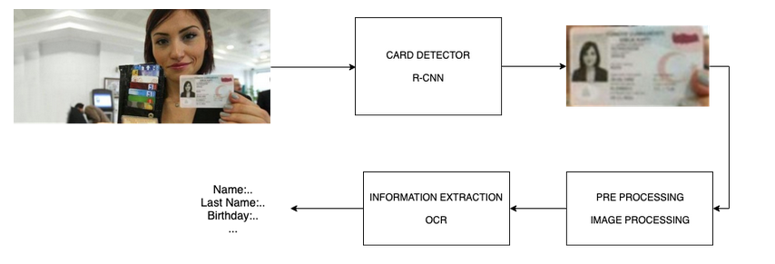

## ID Recognition

### Structure and Usage - 

#### Directories:
	test_images -
		which contains testing images.
	result - 
		it contains JSON object file which contains extracted information.
	model - 
		it contains our Faster RCNN model for detecting card images.
	
#### Files:
	id_card_detail_extract.py - 
		the file will detect the card from the image, crop it and perform required text extraction from the image and save the output in ``result`` folder in JSON format.
	id_card_detection_camera.py - 
		this file can be used to detect card in a live video stream through from a primary camera source.
	
#### Working with the model:
* To make the model to work with your images, put the Aadhar card image inside the ``test_images`` folder and pass in the path of the image to variable name ``IMAGE_NAME`` and ``image_path``.
* Also to get the output cropped image, pass the path (where you want to get the cropped image) for the variable ``output_path``. 
* The output JSON file will be present in ``result`` folder.

#### How to Run:
Tested on Python 3.7

##### Requirements:
* Tensorflow
* OpenCv
* pytesseract
* numpy 

1. To install the requirements.
    ``pip install -r requirements.txt``
    
2. Runs the application with the default webcam. (To detect ID card in live video stream)
    ``python3 id_card_detection_camera.py``

3. Runs the application with the image file. Default image file "test_images/image1.jpg".
``python3 id_card_detail_extract.py ``
	

#### Steps/ Working Flow:
1. First, our **Faster RCNN model tries to Identity Regions of Interest (ROI) containing the required information with deep learning**.
2. If a card is detected it **creates a bounding box around it and crops that part of the image**.
3. That cropped image is then fed into our **OpenCV and pytesseract model** where we perform text extraction.
4. Our model extracts information such as **Name, Gender, Mobile No, UID and Aadhar no. from the image**.
5. The Extracted information is then printed and fed into a **JSON file, where it is saved**.

#### Use Case:

#### Sample ID Cards:

#### Model Accuracy and Performace:
1. The accuracy of our model mostly depends on the **quality of the image as well as the orientation**. (The model presently fails to extract information from tilted or inverted image)
2. The Faster RCNN model is able to **achieve accuracy of more than 90% for detecting a card in the image but also makes the process a bit slower.**
3. But, For extracting Text from the Image **the model needs to be customized** as per the nature of different cards like Aadhar Card, Driving License, Pan Card, etc. 

(The above steps were **implemented for extracting Information from Aadhar Card** and the model works well for it)

